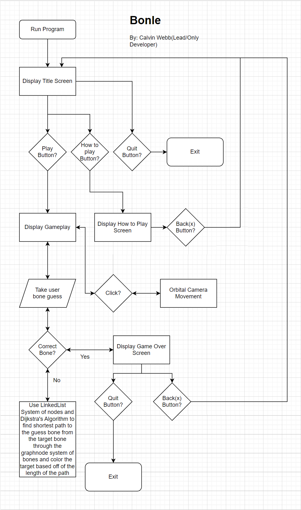

# Bonle
Hot & Cold style application for learning/practicing names and description of different bones in the skeletal systems of a human, a cat, and a dinosaur. Contributes to the medical field, the veterninary field, and the palentology field. There is a learning mode and a practice mode. The learning mode allows you to click on bones get the name and a description of the bone based on the difficulty level you set. Practice mode is the main Hot & Cold part of the application, in which you use the names you learned in the learning mode to find a certain bone within the skeleton chosen.

