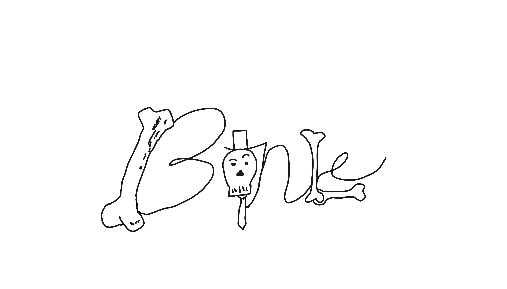

# Bonle
Hot & Cold style video game for learning/practicing names and description of different bones in the skeletal systems of a human, a cat, and a dinosaur. Contributes to the medical field, the veterninary field, and the palentology field.

